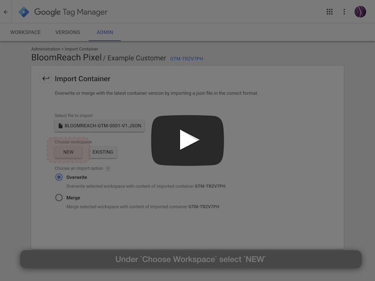
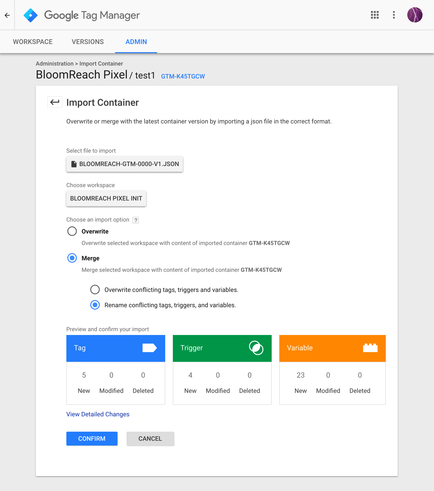
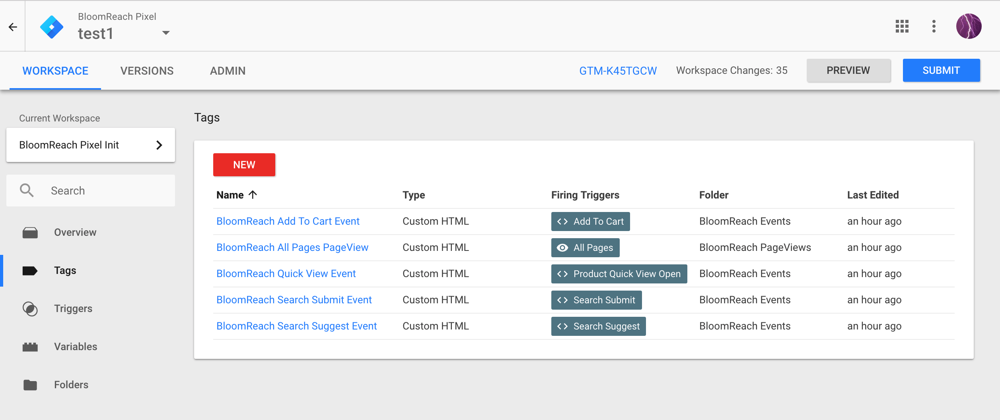

# Integrating BloomReach Pixel with Google Tag Manager

If your site uses Google Tag Manager (GTM) to implement third-party tags such as BloomReach's Pixel, we have created this guide to help you implement our Pixel specification.

At the start of your integration, BloomReach will provide you a list of Tags and Variables to add to your GTM container to help get you started. The Tags and Variables will be delivered in a single JSON file that is importable into your GTM container.

It will be your responsibility:

* For each BloomReach tag, associate the proper triggers needed for the tag specification as provided in the tag's notes section.
* For each BloomReach variable, configure the variable's type and definition to return data that matches our specification provided in the variable's notes section.

If you need further help, please see the [main pixel specification](https://docs.bloomreach.com/display/CORSIG/Pixel+Deployment) or consult with your Technical Project Manager.

## Step by Step Guide

These steps assume:

* You already have a GTM account and a container published on your website.
* You have `edit` permissions to the container you wish to implement against.

### Step 1: Import BloomReach tags/variables into your container

Your Technical Project Manager has created a JSON file that is tailored to the specific Pixel requirements of your site and is importable into your GTM container.

All BloomReach items are prefixed with `BloomReach` and are unlikely to conflict with existing items on your site. The items are categorized into folders prefixed with `BloomReach` to help keep your container organized.

The name of the file follows the format `BLOOMREACH-GTM-{{ACCT_ID}}-v1.json`.

1. Sign in to your Google Tag Manager Account.
2. Select the container you wish to implement our Pixel with.
2. Select the `Admin` tab to navigate to the account and container settings page.
3. In the container settings column, select `Import Container`.
4. Click the `Choose Container File` button and select your provided JSON file (`BLOOMREACH-GTM-{{ACCT_ID}}-v1.json`)
5. Select `New` workspace, name it `BloomReach Pixel Init`, provide an optional description, and click `Save`.
6. [IMPORTANT] Select `Merge` as the import option and then `Rename conflicting tags, triggers, and variables`. The imported items are scoped with BloomReach names and it's highly unlikely you'll encounter naming conflicts.
7. Preview, Verify, and then `Confirm` the import

Import Settings will look similar to image below right before you confirm the import.

### Step 2: Configure BloomReach Tag Triggers

All BloomReach tags, except `BloomReach PageView` are added without an associated trigger. You need to add triggers to each of the remaining tags based on how your site is configured.

If your GTM container doesn't have an existing `Trigger` that satisfies the criteria for firing the BloomReach tag, you will need to setup a new `Trigger`.

1. Navigate to `BloomReach Pixel Init` workspace.
2. Select `Tags` left-hand navigation item.
3. Select the first BloomReach tag.
4. Use the `Notes` section to understand when you should fire this tag on your site (e.g. when a user clicks on the add to cart button)
5. If you have an existing `Trigger` in GTM that satisfies the criteria, select `Choose a trigger to make this tag fire` and select from list of existing. If you do not have an existing `Trigger`, create one with the `+` icon.
6. Repeat steps 4-5 for each remaining BloomReach tag until all tags have triggers.

BloomReach Tags will look similar to below after triggers are added:

### Step 3: Configure BloomReach Variables

At this point your tags will fire, however, they will be missing required data. You still need to configure each individual BloomReach Variables.

Note: On initial import, each BloomReach Variable has been imported with a default variable type and setting for illustration purposes. Out of the box, none of the Variables will resolve properly until they are configured according to how your site and GTM container is setup.

1. Navigate to `BloomReach Pixel Init` workspace.
2. Select `Variables` left-hand navigation item.
3. Select the first BloomReach Variable.
4. Use the `Notes` section to understand how to configure what type of GTM variable to use to.
5. Select `Variable Type` and select the appropriate type from list. Commonly used ones will be `Data Layer Variable`, `JS Variable`, and `Custom JavaScript`.
6. Configure the variable such that when it is evaluated, it will return the type and format expected.
7. Click Save.

### Step 4: Verify Pixel Implementation

1. Deploy Container to your development environment or use the preview functionality of GTM to simulate your BloomReach Pixel work.
2. Use the BloomReach [Pixel Validator instuctions](https://docs.bloomreach.com/display/CORSIG/Pixel+Deployment#PixelDeployment-PixelValidatorHowToUsetheBloomReachPixelValidator) to verify each Tag.
3. If you have any validation issues, please update GTM container appropriately to resolve.
4. Notify your Technical Project Manager that container is deployed on staging.

### Step 5: Publish

When you are confident your container is passing all validations and is ready to be deployed to production, publish your `BloomReach Pixel Init` workspace to your production environment and notify your Technical Project Manager.
